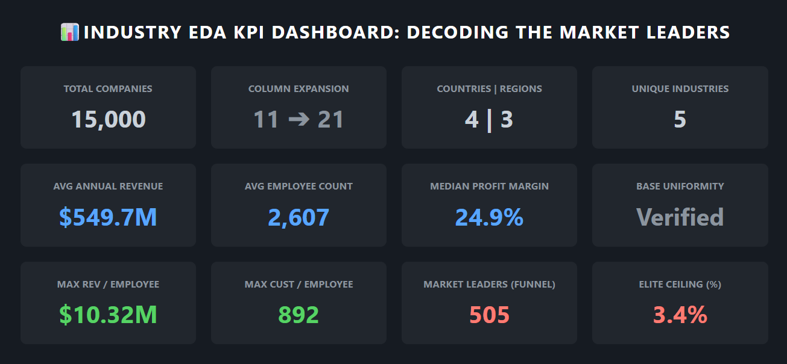

# 📊 Industry Performance EDA: Decoding the Market Leaders


---

> **⚠️ EVALUATION NOTICE:**
> The core statistical methodologies, strategic interpretations, and executive business insights are detailed
> explicitly in the presentation's **Speaker Notes**. Please download the raw
> `Industry_Performance_Presentation.pptx` file to access the full analytical breakdown.

---

<p align="center">
  
</p>
<p align="center"><i>Executive KPI Dashboard — generated at the conclusion of the analytical pipeline.</i></p>

---

## 📌 Project Overview

**Global Enterprise Analytics** is a comprehensive Exploratory Data Analysis (EDA) pipeline evaluating the operational and financial performance of **15,000 global companies** across 5 industries, 4 countries, and 3 geographic regions.

The primary analytical goal was to go beyond standard surface-level reporting and uncover the underlying patterns that separate average market participants from elite **Market Leaders.** By transitioning from baseline metrics to engineered efficiency ratios, this project mathematically proves that competitive advantage is not found in gross company size — but in **operational efficiency.**

> ### 🧪 Statistical Validation
> A rigorous auditing process — including Skewness & Kurtosis evaluation and targeted IQR Outlier Detection — was applied throughout to ensure all business intelligence derived from this dataset is structurally sound.

---

## 🚀 Core Analytical Pipeline — The 8-Phase System

### 🔍 Phase 1–3 — Data Auditing & Structural Integrity
The foundational audit of the 15,000-company dataset, establishing a mathematically sound baseline.
- **Missing Value Audit:** Confirmed zero missing values across all 15,000 records.
- **Duplicate Check:** Every company entry verified as unique.
- **Data Type Validation:** Date and categorical columns realigned to their correct formats.

### 📊 Phase 4 — Exploring Data Characteristics *(The Uniform Baseline)*
Statistical profiling of all numerical and categorical variables before transformation.
- Descriptive statistics confirming balanced distribution across all industries and regions.
- Dataset confirmed as a controlled, representative cross-section of the market.

### ⚙️ Phase 5 — Data Transformation *(The Scale Paradox)*
The critical turning point. Raw data is reshaped to expose hidden market realities.
- **Column Cleanup:** The `id` column was dropped as it carries no analytical value, reducing the base from 12 to 11 columns.
- **Engineered Ratios:** `rev_per_emp`, `rev_per_customer`, and `cust_per_emp` created to measure true operational efficiency beyond raw size.
- **Business Tiers:** Companies categorized by age, revenue scale, customer volume, and overall business model for structured comparison.
- **Result:** Dataset expanded from 11 usable columns to **21 analysis-ready columns.**

### 🌐 Phase 6 — Visualizing Relationships *(The Archetypes)*
Three-layer visual analysis: Univariate → Bivariate → Multivariate.
- **Univariate:** Confirmed uniform base distributions and right-skewed efficiency ratios.
- **Bivariate:** Seasonal revenue cycles, cross-industry boxplots, business model treemaps.
- **Multivariate:** Correlation heatmap, cross-sector efficiency analysis, radar and hexagon profiles of Market Leaders.

### 🎯 Phase 7–8 — Outlier Detection & Executive Conclusion
IQR methodology applied to isolate the top ~11% of the dataset. These hyper-efficient companies were intentionally retained as they represent genuine Market Leaders — not data errors.

---

## 🗂️ Repository Structure

```
Industry-EDA-Project/
│
├── Assets/
│   ├── INDUSTRY.csv                        # Source dataset (15,000 rows × 12 columns)
│   └── full_kpi_dashboard.png              # Executive KPI dashboard (hero image)
│
├── EDA_ENV/                                # Virtual environment (not tracked in Git)
│
├── Industry_Performance_EDA_v2.0.ipynb     # Main analysis notebook
├── requirements.txt                        # Python dependencies
└── README.md                               # This file
```

---

## 📂 Dataset Overview

| Property | Detail |
|---|---|
| **File** | `INDUSTRY.csv` |
| **Records** | 15,000 companies |
| **Original Features** | 12 columns |
| **After Transformation** | 21 columns (12 − 1 dropped + 10 engineered) |
| **Industries** | Finance, Technology, Retail, Healthcare, Manufacturing |
| **Countries** | India, USA, Germany, Canada |
| **Regions** | Asia, North America, Europe |
| **Founded Year Range** | 1990 – 2020 |

### Dataset Dictionary (Post-Auditing)

> *Note: The data types listed below reflect the optimized, memory-efficient formats applied during Phase 1–3 Data Auditing (e.g., casting raw string objects to `Categorical` and `Date` types), rather than the raw, unoptimized CSV formats.*

| Column | Optimized Type | Description |
|---|---|---|
| `id` | Integer | Unique identifier — dropped during transformation |
| `company_name` | Text | Company name |
| `industry` | Categorical | Business sector |
| `country` | Categorical | Country of operation |
| `employee_count` | Integer | Total number of employees |
| `annual_revenue_million` | Float | Annual revenue in USD millions |
| `profit_margin_percent` | Float | Profit margin as a percentage |
| `founded_year` | Integer | Year the company was established |
| `customer_count` | Integer | Total number of customers |
| `market_rating` | Float | Market performance rating |
| `created_date` | Date | Record creation date |
| `region` | Categorical | Geographic region |

---

## 🔧 Feature Engineering

Ten additional features were engineered to expose operational dynamics not visible in the raw dataset:

| Engineered Feature | Description |
|---|---|
| `company_age` | Years since founding — converts founding year into a directly comparable age metric |
| `rev_per_emp` | Revenue per employee — measures workforce efficiency |
| `rev_per_customer` | Revenue per customer — measures customer value |
| `cust_per_emp` | Customers per employee — measures operational scale |
| `industry_density` | Number of competitors operating in the same sector |
| `age_tier` | Company lifecycle stage — Growth or Established |
| `rating_tier` | Market performance bracket — Low Performer, Average Performer, or Market Leader |
| `revenue_tier` | Revenue scale — Micro, Medium, Large, or Enterprise |
| `customer_tier` | Customer volume bracket — Niche or Mass-Scale |
| `business_model` | Combined revenue × customer tier label capturing overall operating strategy |

---

## 📈 Key Findings

- **Industry does not determine success.** All five sectors produce identical proportions of Market Leaders, Average Performers, and Low Performers. Sector alone cannot predict financial outcome.

- **Raw size does not drive revenue.** The correlation between employee count and annual revenue is effectively zero (−0.002). Headcount growth does not produce proportional revenue growth.

- **Efficiency is the real differentiator.** Engineered efficiency ratios revealed massive performance gaps completely invisible in the raw data.

- **The Technology Niche anomaly.** Technology companies operating under a Niche business model generate approximately **$3.0M revenue per employee** — the highest efficiency ratio of any industry-model combination in the entire dataset.

- **Scale and profitability trade off.** The largest Mass-Scale business models lead in total revenue but operate at the lowest profit margins. Smaller, focused operations consistently show stronger margin efficiency.

- **Seasonal revenue volatility.** Monthly revenue follows a repeating cycle with three consistent peaks per year aligned with business quarter starts. Profit margins, however, improve steadily — lowest in Q1, highest in Q4.

- **Outliers represent genuine elite performers.** Approximately 11% of companies in the efficiency metrics fall outside the standard range. These were intentionally retained as they represent a distinct class of highly scalable, lean-operating businesses.

- **Geographic and temporal neutrality.** Country, region, and founding year showed near-zero correlation with revenue outcomes. Where a company is located or when it was founded does not determine how well it performs.

---

## 📦 Library Architecture

| Library | Version | Project Purpose |
|---|---|---|
| `pandas` | 2.2.3 | Data manipulation, DataFrame structuring, and aggregation |
| `numpy` | 2.2.0 | Mathematical operations, array handling, and IQR percentile calculations |
| `matplotlib` | 3.10.0 | Core plotting and static chart rendering |
| `seaborn` | 0.13.2 | Statistical visualizations — heatmaps, boxplots, and distribution plots |
| `scipy` | 1.15.0 | Skewness, kurtosis, and statistical profiling |
| `scikit-learn` | 1.6.0 | MinMax normalization for radar chart scaling |
| `squarify` | 0.4.4 | Treemap visualizations for business model market share |
| `jupyter` | 1.1.1 | Notebook environment |

---

## 💻 Installation & Setup

### Prerequisites
Ensure **Python 3.10+** is installed on your system.

---

### Option 1: Google Colab *(Recommended — Zero Setup)*

If you are reviewing this project via Google Colab, **no local installation or `requirements.txt` is necessary.**

1. Upload `Industry_Performance_EDA_v2.0.ipynb` to your Colab session.
2. Upload `INDUSTRY.csv` to Colab session storage, or mount your Google Drive.
3. Run all cells. Colab natively supports all required libraries.

---

### Option 2: Local Jupyter Environment

**1. Clone the repository:**
```bash
git clone https://github.com/S-Yousuf-S/NHIS_Project3.git
cd NHIS_Project3
```

**2. Create a virtual environment:**
```bash
python -m venv EDA_ENV
```

**3. Activate the environment:**

Windows:
```bash
EDA_ENV\Scripts\activate
```

macOS / Linux:
```bash
source EDA_ENV/bin/activate
```

**4. Install dependencies:**
```bash
pip install -r requirements.txt
```

**5. Launch the notebook:**
```bash
jupyter notebook Industry_Performance_EDA_v2.0.ipynb
```

---

## 🙋 Frequently Asked Questions

**Q: Why were outliers kept instead of removed?**

**A:** The outliers in the engineered efficiency ratios are not data errors — they are genuinely high-performing, lean-operating companies. Removing them would erase the exact segment being studied and flatten elite performers into average statistics, producing a misleading picture of the market.

---

**Q: Why was the Median used instead of the Mean for the quarterly profit trend?**

**A:** The efficiency metrics carry a strong right skew driven by the top ~11% of outlier companies. The Mean is artificially pulled upward by this group. The Median cuts through the skew to accurately represent the true typical company baseline.

---

**Q: Why was Feature Engineering necessary if the dataset already had 12 columns?**

**A:** Univariate analysis proved that all base metrics — gross revenue, total employees, total customers — were synthetically uniform with near-zero variance between companies. Raw size masked all meaningful differences. Efficiency ratios (revenue *per* employee, revenue *per* customer) were essential to expose the operational gaps between companies.

---

**Q: Why was the `id` column dropped?**

**A:** The `id` column is a row identifier with no analytical value. It carries no business meaning and would only introduce noise if included in statistical summaries or visualizations.

---

**Q: What is the most significant finding in the dataset?**

**A:** Technology companies operating under a Niche business model generate approximately **$3.0M revenue per employee** — dramatically higher than any other industry-model combination. They achieve this by operating with lean, focused teams rather than large workforces, proving that efficiency of scale matters far more than scale itself.

---

**Q: Does the founding year or geographic location affect revenue?**

**A:** No. Correlation analysis confirmed near-zero relationships between founding year, country, region, and annual revenue. A company founded in 1990 does not earn more than one founded in 2015, and a company in North America does not structurally outperform one in Asia. Performance is determined by operational behavior, not timing or location.

---

**Q: What is the next logical step for this pipeline?**

**A:** With Market Leaders isolated and their operational profiles defined, the natural next step is applying Unsupervised Machine Learning — specifically K-Means Clustering — to formally group companies by efficiency archetype, followed by deploying the visual models into an interactive **Streamlit** dashboard for executive use.

---

## 🎯 Conclusion

This project demonstrates that a structured, story-driven EDA pipeline can extract non-obvious business intelligence from even a synthetically uniform dataset. Every analytical decision — from retaining outliers to engineering efficiency ratios — was made with deliberate purpose, ensuring the insights delivered are grounded, defensible, and actionable.

---

## 👤 Author

**Yousuf S. R. Sakkaf**

GitHub: [S-Yousuf-S](https://github.com/S-Yousuf-S/NHIS_Project3)

---

⭐ *If you found this analysis insightful, consider starring the repository!*
